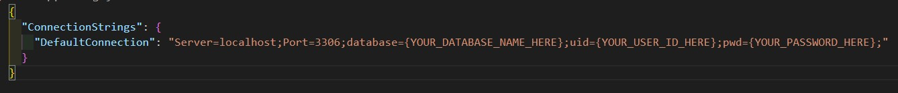

# _Many to Many Relationships_

#### By:
_*Peter Philavanh*_

### Machine Shop

## Technologies Used

* _VS Code_
* _C#_
* _MySql Workbench_
* _Entity Framework core v6.0.0_
* _Asp.Net Core Mvc Rendering_

## Description
This is a website designed to explore many to many relationships. The user will act as a factory manager who is in charge of hiring engineers and adding machines to a list to be fixed by engineers. The manager has the abilility to add, edit, and delete both engineers and machines. The shop manager can assign engineers to machines and vice versa.

## Setup/Installation Requirments
* _Clone this repo to your local machine_
* _Navigate to the file and open with your code editor_
* _Create a database using the structure data from `peter_philavanh_factory_dump.sql`_
* _`$cd Factory/` to go into production folder_
* _Create a new `appsettings.json` within your production directory, use the image below as an example for the contents of the appsettings file_

* _Enter `$ dotnet build` to build project_
* _Enter `$ dotnet run` to host local server to browse project_

## Known Bugs
* _No bugs have been found at this time_
* _Please report any bugs to efli2ce89@gmail.com_

## Licensing
This is licensed under the [MIT](https://opensource.org/licenses) license
Copyright (C) January 2023 Peter Philavanh
